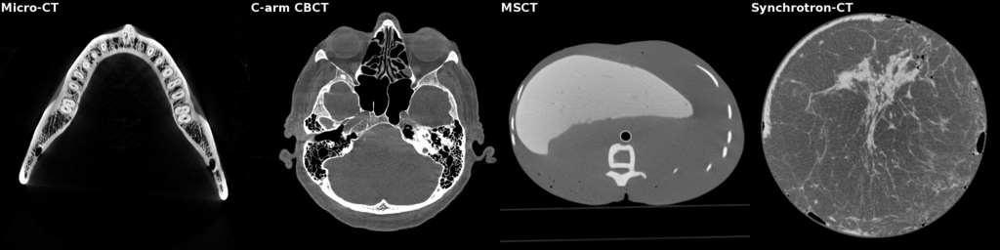

# Generic Computed Tomography (GCT)

GCT (Generic Computed Tomography) is a GPU-accelerated image reconstruction and processing toolkit for CT systems of various detector and projection geometries.
GCT can currently reconstruct cross-sectional images from the following axial scan (circular X-ray source trajectory) projections using FDK (Feldkamp, Davis, and Kress) algorithm:

1. 1D parallel projection.
2. 1D fan-beam projection (line detector).
3. 1D fan-beam projection (arc detector).
4. 2D parallel projection.
5. 2D rebinned or cone-parallel projections.
6. 2D cone-beam projection (cylindrical detector).
7. 2D cone-beam projection (flat detector).

GCT presents a novel software design to describe the CT geometry by utilizing the generic 
programming techniques of modern (C++ 20) and CUDA C++. Our aim is to design scalable 
and maintainable reconstruction software by following the SOLID principles (https://en.wikipedia.org/wiki/SOLID).

Here are the images reconstructed from the real projections with the GCT FDK algorithm.



Micro-CT: The full-scan projections were acquired using the micro-CT scanner with flat
detector (Carl Zeiss Metrotom). Images courtesy of Fraunhofer IPK, Berlin, Germany. <br/>

C-arm CBCT: The short-scan projections were acquired using the interventional C-arm CBCT scanner 
with flat
detector (Siemens Artis Q). Images courtesy of Magdeburg university hospital, Magdeburg, Germany. <br/>


MSCT: The full-scan projections were acquired using the Multi-Slice CT scanner with cylindrical
detector.<br/>

Synchrotron-CT: The half-scan parallel projections were acquired using the Synchrotron-CT scanner.
Images courtesy of Australian Nuclear Science and Technology Organisation. <br/>


# Documentation
The paper describing the design of GCT has been published in the conference proceedings
of the 17th International Meeting on Fully Three-Dimensional
Image Reconstruction in Radiology and Nuclear Medicine.
The title of the paper is 'A generic software design for computed tomography in modern C++' and it 
can be accessed from the link: https://arxiv.org/abs/2310.16846


# Installation and software build
The current version of GCT requires a C++ compiler that supports C++ 20 features, such as concepts,
and an NVIDIA CUDA compiler and toolkit that supports CUDA 12.0. Please check the official CUDA 
installation
instructions for your operating system. It is to be noted that only NVIDIA GPUs of Maxwell, Pascal,
Volta, Turing, Ampere, Ada Lovelace, and Hopper architectures support CUDA 12.0.
Unfortunately, GCT cannot be run on GPUs of Tesla, Fermi, and Kepler architectures.

Currently, GCT has been installed and tested only in Ubuntu 22.04 LTS. We will add installation 
instructions for the Windows operating system after testing.

## Ubuntu 22.04 LTS
Here are the installation instructions we followed for the laptop with RTX 3070 GPU (Ampere
architecture) running Ubuntu 22.04 LTS. The following instructions are based on the assumption
that you have access to a computer with freshly installed Ubuntu 22.04 LTS.
Before executing the commands in the terminal right away,
read all installation instructions to determine the packages that you
need to install (some packages may have already been installed), and the best option for
installation and program compilation if there are alternatives available.


### 1. Installing g++ compiler and other tools for building C++ programs

Verify whether the g++ compiler has already been installed:

```console
g++ --version
```

As per the CUDA documentation, at least gcc/g++ 10 is required for CUDA 12.0.
We would recommend installing g++ 11 for new C++ features. In Ubuntu 22.04 LTS,
the following commands will install g++ 11.3 and other packages for building C/C++ programs
such as make:

```console
sudo apt update
sudo apt install build-essential
```
It is to be noted that in Ubuntu 18.04 LTS and 20.04 LTS, the above commands will install
gcc/g++ 7.5.0 and 9.3.0, respectively.
Hence, you have to install g++ 11 separately:

```console
sudo apt update
sudo apt install gcc-11 g++-11
```

### 2. Installing cmake (3.26.3)

```console
sudo apt-get install cmake
```

### 3. Installing NVIDIA driver version 530
Since GCT is a CUDA-based application, NVIDIA driver compatible with CUDA toolkit 12.0 is
necessary.
The minimum driver version required for CUDA 12.0 and CUDA 12.1 is 525.60.13.
You can install it via the Software and Updates app (Additional Drivers tab) of the Ubuntu operating system
or with the following command:

```console
sudo apt install nvidia-driver-530
```
Please reboot after installing the driver.

### 4. Installing CUDA Toolkit 12.1 Update 1
Follow the installation instructions listed in
[CUDA website](https://developer.nvidia.com/cuda-downloads?target_os=Linux&target_arch=x86_64&Distribution=Ubuntu&target_version=22.04&target_type=deb_network).


After installation, verify with the following command:
```console
nvcc --version
```
If the nvcc version is not displayed, the following environment variables are needed to
set by editing the .bashrc file located in $HOME directory.<br />
export PATH="/usr/local/cuda-12.1/bin:$PATH"<br />
export LD_LIBRARY_PATH="/usr/local/cuda-12.1/lib64:$LD_LIBRARY_PATH"<br />

```console
cd $HOME
gedit .bashrc
```
Add the above two lines to set the environment variables and close the file.
To apply the change in the current session:
```console
source ~/.bashrc
```
And try again to check the nvcc version:
```console
nvcc --version
```

### 5. Installing git

```console
sudo apt-get install git-all
```

### 6. Download source files and build GCT libraries and programs
```console
git clone --recursive https://github.com/satidev/gct.git
cd gct
mkdir build
cd build
cmake ..
make 
```
Alternatively (also ideally!), popular IDEs like
[Visual Studio Code](https://code.visualstudio.com/) can be used to  
edit source files and build GCT. 

#### Installation of VS Code and necessary and optional extensions
1. Install Visual Studio Code (via Ubuntu Software or from the link https://code.visualstudio.com/).
2. Launch VS Code.
3. Install C/C++ extension from Microsoft (click Extensions and search for C/C++).
4. Install CMake Tools extension from Microsoft.
5. Optional: install C/C++ Extension Pack from Microsoft.
6. Optional: install Nsight Visual Studio Code Edition from NVIDIA.

#### Compilation and build of GCT in visual studio code
1. Clone GCT repository recursively to a local directory.
```console
mkdir gct_vs
cd gct_vs
git clone --recursive https://gitlab.stimulate.ovgu.de/shiras-abdurahman/gct.git
```
2. Launch VS Code.
3. Click File -> Open Folder and select the gct directory where the main CMakeLists.txt exists.
   (gct_vs/gct)
4. Select host compiler (e.g., GCC 11.3 ) for GCT (Select a Kit for GCT).
5. Make sure that the configuration is successful and build files have been written to build 
   directory.
6. Build the library and program: click Terminal -> Run Build Task -> CMake: build.


# Test data and example reconstructions

To run the example reconstructions listed example_recon.h file, 
please download the test data from the following link:
https://data.stimulate.ovgu.de/f/43c71c8a810840df8aef/?dl=1

The projection data was generated using the CT simulation toolkit
[CTL](https://gitlab.com/tpfeiffe/ctl).

After the successful compilation of GCT programs, the example reconstructions
can be performed as given below:

```console
# Change to directory where the gct executable lies.
cd build
# Unzip the downloaded file contaning test data.
# Pass the directory name as a command line arugment to gct executable.
./gct /path/gct_test_data
```


